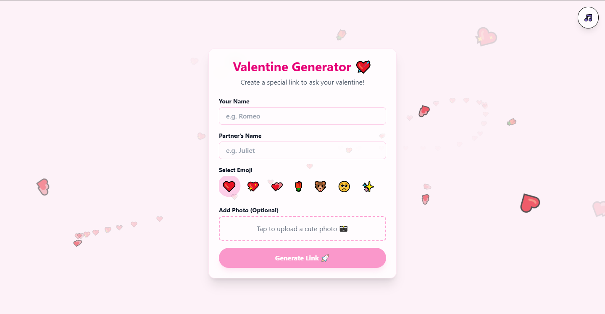

# 💖 Will You Be My Valentine? — React Web App

A playful, mobile-first web application designed to help you ask **"Will you be my Valentine?"** in the most creative and digital way possible. 

The app features a **Generator** to create personalized links, a **Question Page** with an uncatchable "No" button, and a **Celebration Page** with confetti and music.

🌐 **Live Demo:**  
👉 https://valentine-blue-beta.vercel.app/





## ✨ Features

- **Personalized Links**: Enter your name and your partner's name to generate a unique link.
- **Smart "No" Button**: The "No" button is evasive! It runs away from the cursor or touch, ensuring it forces a "Yes". It uses smart logic to **always** stay visible on screen.
- **Heart Trails**: A beautiful trail of hearts follows your mouse or finger.
- **Romantic Atmosphere**: Background music (toggleable), floating hearts, and a custom heart cursor.
- **Mobile First**: Designed to look perfect on phones and desktops alike.
- **No Backend Required**: All personalization data is stored safely in the URL itself.

## 🚀 Getting Started

### Prerequisites

- Node.js (v18 or higher)
- npm or yarn

### Installation

1.  **Clone the repository** (or download source):
    ```bash
    git clone https://github.com/yourusername/valentine-app.git
    cd valentine-app
    ```

2.  **Install dependencies**:
    ```bash
    npm install
    ```

3.  **Run the development server**:
    ```bash
    npm run dev
    ```

4.  Open your browser at `http://localhost:5173`.

## 🛠️ Tech Stack

-   **Frontend**: React + Vite
-   **Styling**: Tailwind CSS (v4)
-   **Routing**: React Router DOM (v7)
-   **Animations**: CSS Keyframes & Canvas Confetti
-   **Icons**: Native Emojis & SVG

## 📦 Deployment (Vercel)

This app is optimized for Vercel.

1.  Push your code to GitHub.
2.  Import the project into Vercel.
3.  Deploy!
4.  Share your live link!

## 💌 How to Use

1.  Open the app.
2.  Fill in **Your Name** and **Partner's Name**.
3.  (Optional) Add a cute photo and choose an emoji.
4.  Click **Generate Link**.
5.  Copy the link and send it to your special someone! ❤️

---
Made with ❤️ by Navaneeth.k.v
